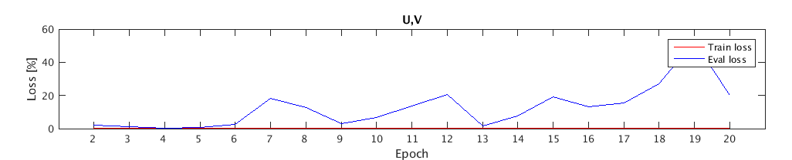
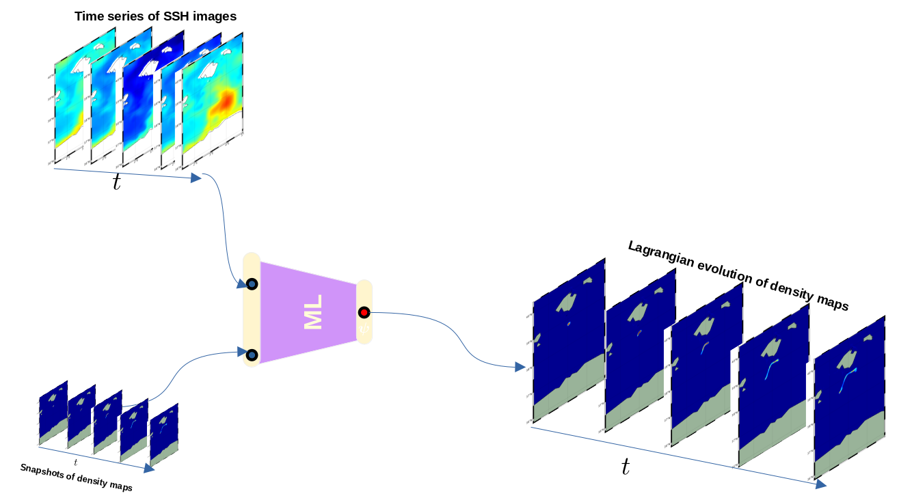
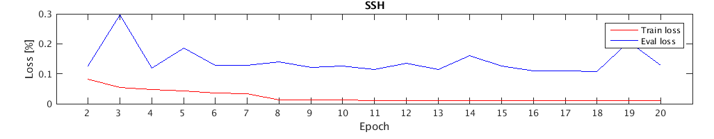
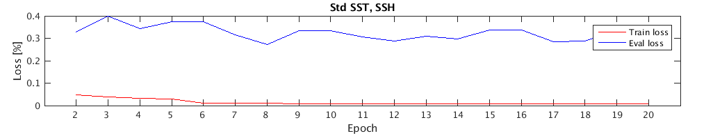
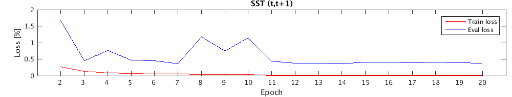
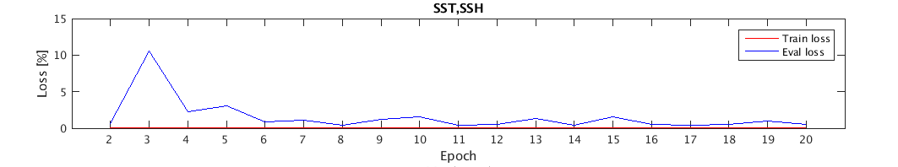
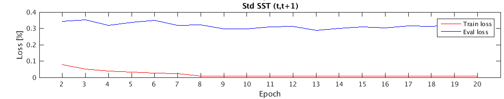
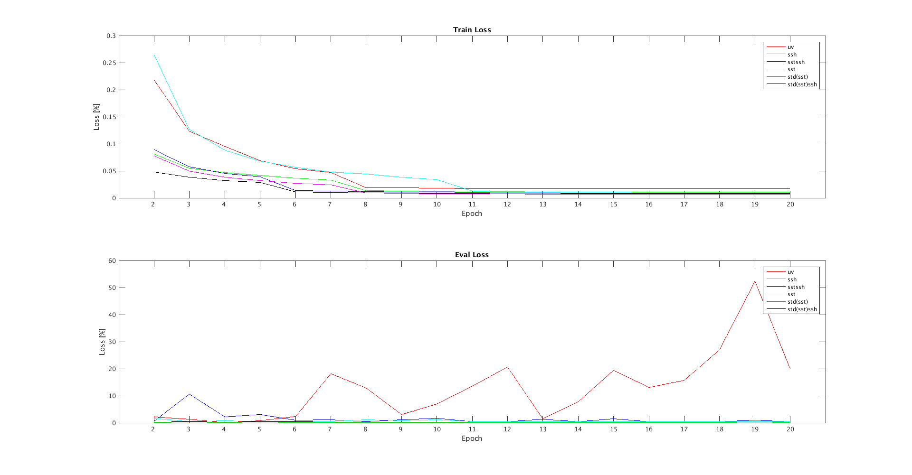

This part describes the different simulations carried so far (using RMSE as a loss function). 

U and V
-------------

First simulation takes as input the velocity field to learn the advection of the probability densities. Here we are learning exactly from the same data that are used to generate the ground-truth. With that being said, we (from AI point of view) expect it to have the best results!

We run our experiment for a total of 20 epochs, and the image below shows the evolution of the loss function against each epoch.

Our machine converges quite fast but starts over-training right after the 5th Epoch!

##### Video example of the ground truth vs ML(U,V) advection:

***

SSH
-------------

Second simulation takes as input  Sea Surface Height to learn the advection of the probability densities.
If we consider observational data, SSH should give better results than (U,V). The latter are derived from SSH under geostrophic approximation and for sure admit mapping/processing errors! 

We run our experiment for a total of 20 epochs, and the image below shows the evolution of the loss function against each epoch. To my understanding it seems like we learn more from SSH than (U,V). 

##### Video example of the ground truth vs ML(ssh) advection:

***

SST and SSH
-------------

SSH alone gives really promising results and physically makes lot of sense. What if we feed more information to our machine, SST for instance,  will it be able to learn more?
SST encode, in addition to temperature, information about coherent structures, and they themselves inform us about transport barriers that shape the fluid flow. So theoretically we should retrieve more information. 
The third simulation takes as input Sea Surface Temperature and Sea Surface Height to learn the advection of the probability densities.

We run our experiment for a total of 20 epochs, and the image below shows the evolution of the loss function against each epoch. The results are definitely better that (U,V) but not SSH. 

##### Video example of the ground truth vs ML(ssh,sst) advection:

Visually, combining SST and SSH seems to miss-up with the machine ( due to different order of magnitude --> standardize SST)

***

SST (t,t+1)
-------------

Fourth simulation takes as input two consecutive Sea Surface Temperature images to learn the advection of the probability densities.
This experiment mostly describe the optical flow which describes pattern of apparent motion of objects, surfaces, and edges in a visual scene caused by the relative motion between an observer and a scene.
Back to observational data, SST does encode sub-mesoscale dynamics (and barrier transport), and combining SST(t,t+1) will definitely inform us about the causality linking them, that is the transport.

We run our experiment for a total of 20 epochs, and the image below shows the evolution of the loss function against each epoch.
The results are slightly better than the one above(sst,ssh) and are far better from (U,V). There are some promising results and worth trying them on satellite images!

##### Video example of the ground truth vs ML(sst(t,t+1)) advection:

***

Standardized SST (t,t+1)
-------------

The fifth simulation is similar to the one above but SST are standardized. 

We run our experiment for a total of 20 epochs, and the image below shows the evolution of the loss function against each epoch. We observe an improvement of the results compared to raw SST!

##### Video example of the ground truth vs ML(Std(sst[t,t+1])) advection:

***

SSH and  standardized SST 
-------------

The sixth simulation takes as input standardized Sea Surface Temperature and Sea Surface Height to learn the advection of the probability densities.
We run our experiment for a total of 20 epochs, and the image below shows the evolution of the loss function against each epoch. The results are not different from standardized SST alone.

##### Video example of the ground truth vs ML(Std(sst), ssh) advection:

***

Intercomparison
-------------

Sorry but (U,V) ruined pretty much everything! I will try to find a way for a nicer plot.

