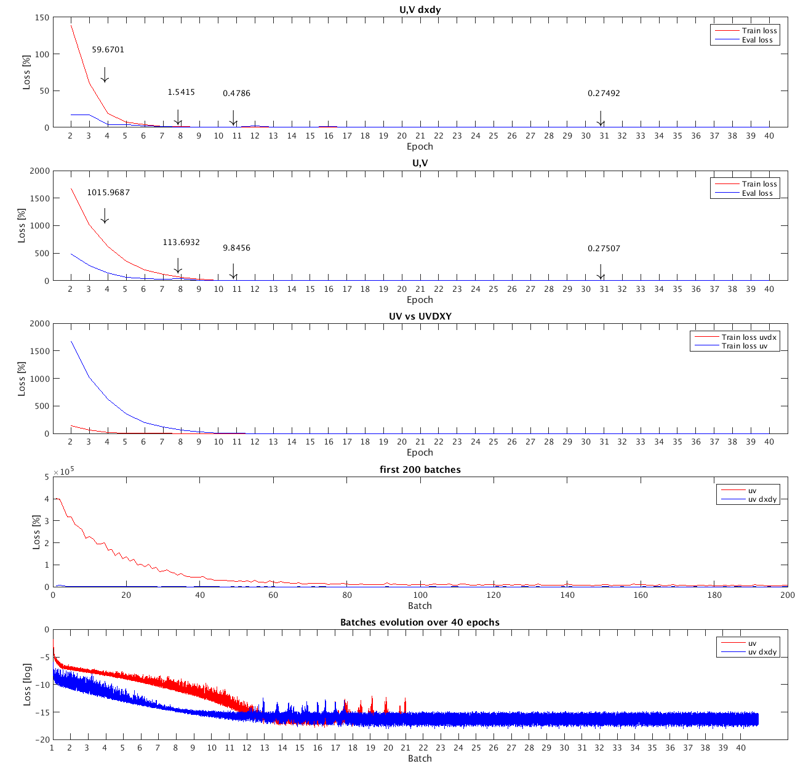

Few results using ResNet arch.

###### Number of parameters:

```
+-------------------------------------+------------+
|               Modules               | Parameters |
+-------------------------------------+------------+
|         initial_layer.weight        |     80     |
|          initial_layer.bias         |     16     |
| blocks.0.batch_norm_layers.0.weight |     16     |
|  blocks.0.batch_norm_layers.0.bias  |     16     |
| blocks.0.batch_norm_layers.1.weight |     16     |
|  blocks.0.batch_norm_layers.1.bias  |     16     |
|    blocks.0.conv_layers.0.weight    |    2304    |
|     blocks.0.conv_layers.0.bias     |     16     |
|    blocks.0.conv_layers.1.weight    |    2304    |
|     blocks.0.conv_layers.1.bias     |     16     |
|          final_layer.weight         |     16     |
|           final_layer.bias          |     1      |
+-------------------------------------+------------+
Total Trainable Params: 4817
```

###### Configuration to generate density maps:

We reduced the number of data to:

```yaml
    n_samples : 100
    ensemble_size : 2000
    ensemble_radius : 5 km
    particle_runtime : 3 days
    particle_output_dt : 6 hours
    particle_dt_RK4 : dt(hour:=3)
```

###### Results:

 we conducted two simulations:

(U, V) and (U,V) plus dx dy, following figures shows the evolution of Loss against Batches and Epochs.


