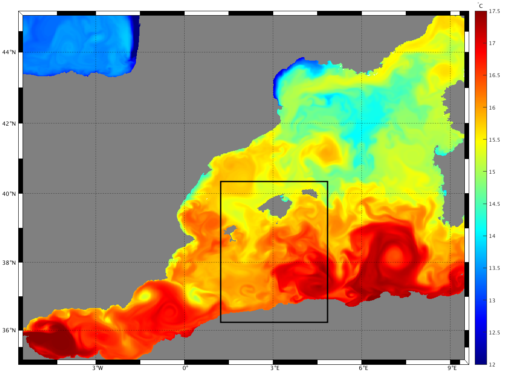
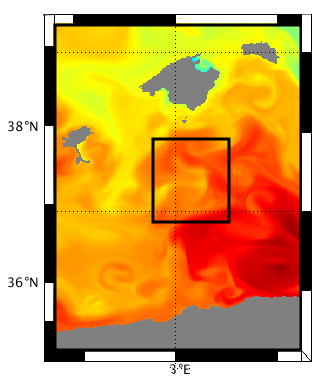
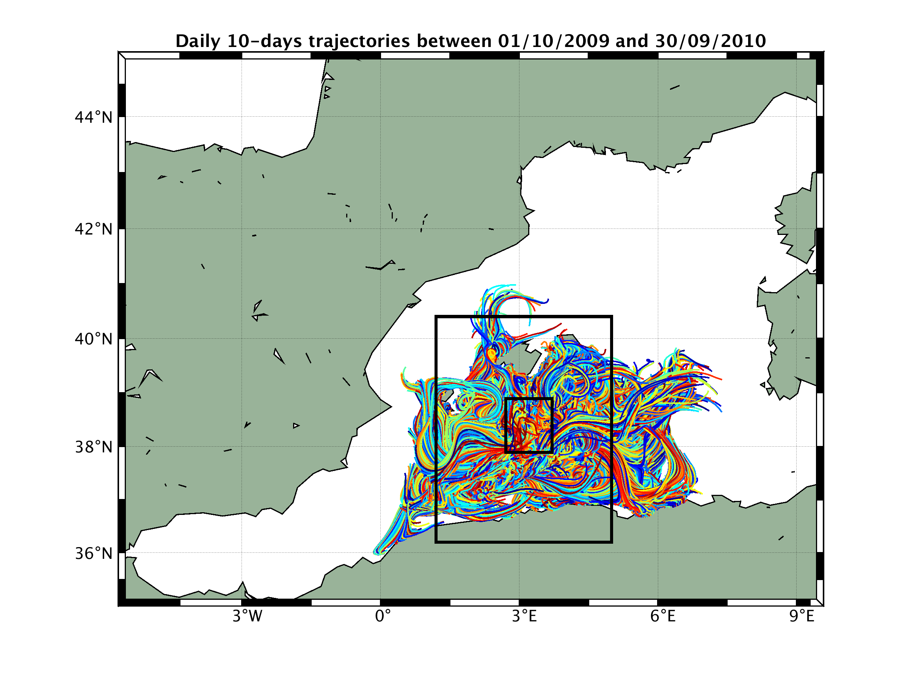
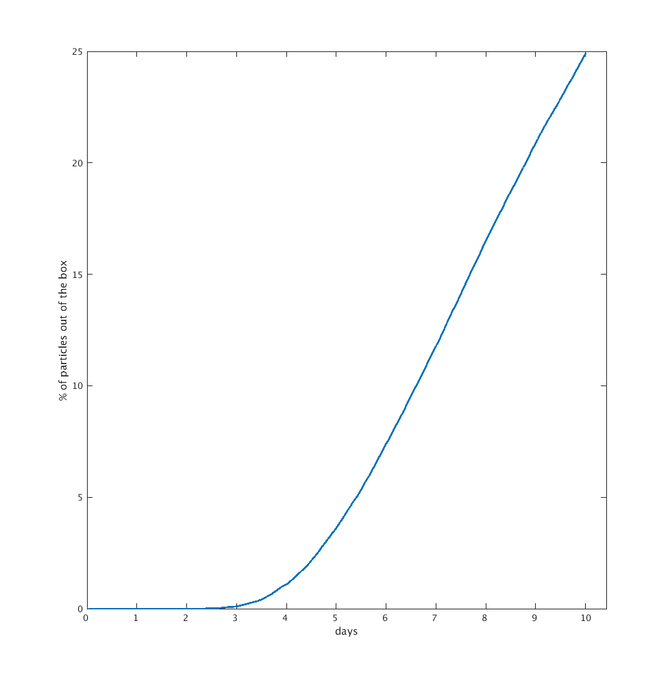
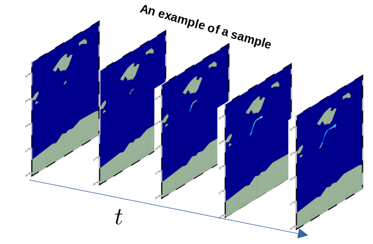

This part describes the setup used in ML-Drop project.


-------------

Region of study
-------------

This work focuses on the region between the Balearic islands and the Algerian coastline (encircled bellow in black)


The choice of this particular areas is motivated mainly by the [CNES-NASA SWOT](https://swot.jpl.nasa.gov/mission/overview/) mission, and more particularly the research activities of [MEOM-team](https://meom-group.github.io/).


-------------

Generation of density maps
-------------
In this project we are mainly learning the fokker-planck equation of a lost object in the ocean, that is the time-evolution of probability density function of a object released in the ocean, which also can be modeled in the form of an SDE.
Here we are talking about three main inputs (Area of the initial release of the particle, Time-length of trajectories and Δt) that are discussed in the following:

###### Area of particle release:

We choose the region (span [37.89N ~ 38.89N][ 2.71E ~ 3.71E]) encircled in the image below as the area of particle release, because it will benefit from high SWOT coverage both in space and time.  


###### Time-length of trajectories:

To chose the optimal advection time, we carried a small experiment where we initialized 500 particles daily and randomly in the area of particle release between 01/10/2009 and 20/09/2010, and each time we advect them with the flow using a sliding window of 10 days.



The following image shows the amount of particles leaving the domain with time, and based on it we have fixed 3 days for the time-length for our trajectories. 


###### Choice of Δt:

6 hours choice is related to L2 products.

##### Configuration to generate density maps:

To generate the ensemble of density maps we used the following configuration:

```yaml
    n_samples : 10000
    ensemble_size : 2000
    ensemble_radius : 5 km
    particle_runtime : 3 days
    particle_output_dt : 6 hours
    particle_dt_RK4 : dt(hour:=3)
```
The following image shows an example of a sample: 

