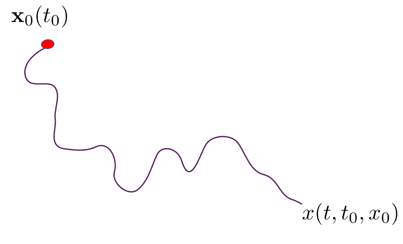
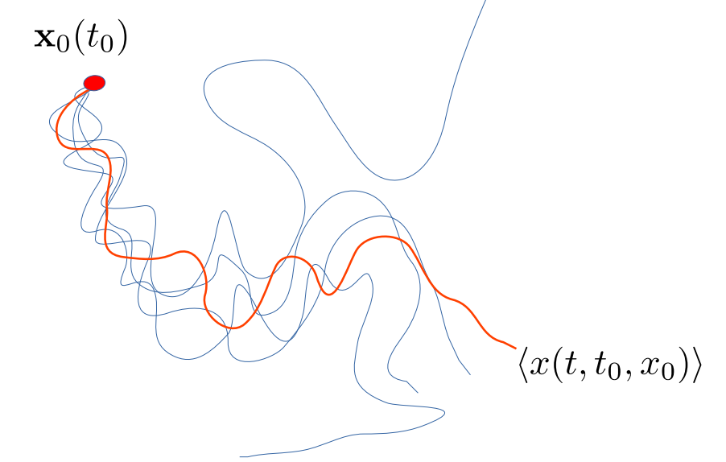
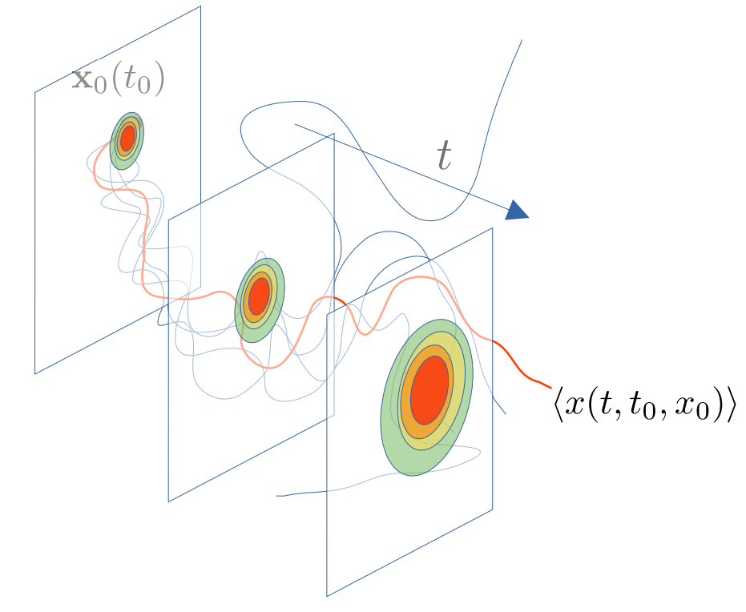

Observing the ocean’s circulation is an important issue for understanding the climate system and marine ecosystems. Ocean currents transport and redistribute heat, carbon, energy, and nutrients through the oceans. Over the past 25 years, the
measurement of sea surface height obtained by satellite altimetry combined with the geostrophic approximation has made it possible to estimate largescale surface ocean circulation. However, these data don’t give any dynamics below 100km, which are very important in understanding the climate machinery in different oceanic applications. On the other hand, there exist other satellite images with higher spatial and temporal resolutions, particularly Sea Surface Temperature and Chlorophyll-a concentration, which in addition to their acquired quantities, they do encode information about other dynamics, particularly transport.

This project takes a Lagrangian perspective and aims at taking full advantage of oceanic tracers to retrieve submesoscale transport properties, initially in the framework of search and rescue missions.

Mathematically speaking, we aim at reconstructing trajectories of and object released in fluid flow. Taking a Lagrangian perspective, and knowing precisely the initial position of the object along with a good velocity field observation, this problem is straightforward to solve.

Unfortunately, this is not always the case, the initial position does mostly include uncertainties along with the velocity fields observation that admit mapping and acquisition errors. This raises this deterministic problem into a stochastic one.
Now we will have a cloud of trajectories instead of a single one:

And these ensembles of trajectories can actually be modeled in the form of density maps as follow:

In this project we are learning new machines that take as an input satellite tracers along with initial position of the lost object and give us  as an output, time series of the probability density presence maps of the lost object. 
